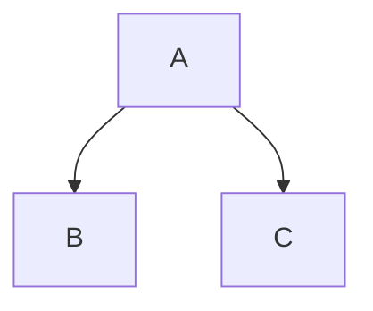

# Changelog

This document contains an overview of all changes between Owl 1.x and
Owl 2.x, with some pointers on how to update the code.

Note that some of these changes can be magically implemented (for example, by
patching the `setup` method of `Component` to auto register all the lifecycle
methods as hooks). This will be done for the transition period, but will be
removed after.

## From Owl 1.x to Owl 2.0

All changes are documented here in no particular order.

**Components**

- components can now have empty content or multiple root nodes (htmlelement or text) ([details](#31-components-can-now-have-arbitrary-content))
- breaking: component.el is removed ([details](#9-componentel-is-removed))
- new `useEffect` hook ([doc](doc/reference/hooks.md#useeffect))
- new `onWillDestroy`, `onWillRender` and `onRendered` hooks ([doc](doc/reference/component.md#lifecycle))
- breaking: lifecycle methods are removed ([details](#1-component-lifecycle-methods-are-removed))
- breaking: can no longer be mounted on detached DOM ([details](#2-components-can-no-longer-be-mounted-in-a-detached-dom-element))
- breaking: standalone `mount` method API is simpler ([details](#4-mount-method-api-is-simpler))
- breaking: components can no longer be instantiated and mounted by hand ([details](#5-components-can-no-longer-be-instantiated-and-mounted-by-hand))
- breaking: components can no longer be unmounted/remounted ([details](#6-components-can-no-longer-be-unmountedremounted))
- breaking: template name is no longer inferred from the class name ([details](#7-template-name-is-no-longer-inferred-from-the-class-name))
- breaking: components no longer have a `shouldUpdate` method ([details](#8-components-no-longer-have-a-shouldupdate-method))
- breaking: components can no longer be mounted with position=self ([details](#11-components-can-no-longer-be-mounted-with-positionself))
- breaking: `render` method does not return a promise anymore ([details](#35-render-method-does-not-return-a-promise-anymore))
- breaking: `catchError` method is replaced by `onError` hook ([details](#36-catcherror-method-is-replaced-by-onerror-hook))
- breaking: Support for inline css (`css` tag and static `style`) has been removed ([details](#37-support-for-inline-css-css-tag-and-static-style-has-been-removed))
- new: prop validation system can now describe that additional props are allowed (with `*`) ([doc](doc/reference/props.md#props-validation))
- breaking: prop validation system does not allow default prop on a mandatory (not optional) prop ([doc](doc/reference/props.md#props-validation))
- breaking: rendering a component does not necessarily render child components ([details](#40-rendering-a-component-does-not-necessarily-render-child-components))


**Templates**

- breaking: `t-foreach` should always have a corresponding `t-key` ([details](#20-t-foreach-should-always-have-a-corresponding-t-key))
- breaking: `t-ref` does not work on components ([details](#29-t-ref-does-not-work-on-component))
- breaking: `t-raw` directive has been removed (replaced by `t-out`) ([details](#38-t-raw-directive-has-been-removed-replaced-by-t-out))
- new: add support for synthetic events ([doc](doc/reference/event_handling.md#synthetic-events))
- breaking: style/class on components are now regular props ([details](#10-styleclass-on-components-are-now-regular-props))
- new: components can use the `.bind` suffix to bind function props ([doc](doc/reference/props.md#binding-function-props))
- breaking: `t-on` does not accept expressions, only functions ([details](#30-t-on-does-not-accept-expressions-only-functions))
- breaking: `t-on` does not work on components any more ([details](#12-t-on-does-not-work-on-components-any-more))
- new: an error is thrown if an handler defined in a `t-on-` directive is not a function (failed silently previously in some cases)
- breaking: `t-component` no longer accepts strings ([details](#17-t-component-no-longer-accepts-strings))
- new: the `this` variable in template expressions is now bound to the component


**Reactivity**

- finer grained reactivity: owl 2 tracks change per key/component
- finer grained reactivity: sub components can reobserve state ([doc](doc/reference/reactivity.md))
- new: `reactive` function: create reactive state (without being linked to a component) ([doc](doc/reference/reactivity.md#reactive))
- new: `markRaw` function: mark an object or array so that it is ignored by the reactivity system ([doc](doc/reference/reactivity.md#markraw))
- new: `toRaw` function: given a reactive objet, return the raw (non reactive) underlying object ([doc](doc/reference/reactivity.md#toraw))


**Slots**

- breaking: `t-set` does not define a slot any more ([details](#3-t-set-will-no-longer-work-to-define-a-slot))
- slots capabilities have been improved ([doc](doc/reference/slots.md))
  - params can be give to slot content (to pass information from slot owner to slot user)
  - slots are given as a `prop` (and can be manipulated/propagated to sub components )
  - slots can define scopes (to pass information from slot user to slot owner)


**Portal**

- Portal are now defined with `t-portal` ([details](#33-portal-are-now-defined-with-t-portal))
- portals can now have arbitrary content (no longer restricted to one single child)
- breaking: does no longer transfer dom events ([details](#13-portal-does-no-longer-transfer-dom-events))
- breaking: does render as an empty text node instead of `<portal/>` ([details](#14-portal-does-render-as-an-empty-text-node-instead-of-portal))


**Miscellaneous**

- improved performance
- much simpler code 
- new App class to encapsulate a root Owl component (with the config for that application) ([doc](doc/reference/app.md))
- new `useEffect` hook ([doc](doc/reference/hooks.md#useeffect))
- breaking: `Context` is removed ([details](#15-context-is-removed))
- breaking: `env` is now totally empty ([details](#16-env-is-now-totally-empty))
- breaking: `env` is now frozen ([details](#28-env-is-now-frozen))
- new hook: `useChildSubEnv` (only applies to child components) ([details](#27-usechildsubenv-only-applies-to-child-components))
- breaking: most exports are exported at top level ([details](#18-most-exports-are-exported-at-top-level))
- breaking: properties are no longer set as attributes ([details](#19-properties-are-no-longer-set-as-attributes))
- breaking: `EventBus` api changed: it is now an `EventTarget` ([details](#21-eventbus-api-changed-it-is-now-an-eventtarget))
- breaking: `Store` is removed ([details](#22-store-is-removed))
- breaking: `Router` is removed ([details](#23-router-is-removed))
- breaking: transition system is removed ([details](#24-transition-system-is-removed))
- breaking: no more global components or templates ([details](#25-no-more-global-components-or-templates))
- breaking: `AsyncRoot` utility component is removed ([details](#26-asyncroot-utility-component-is-removed))
- breaking: `renderToString` function on qweb has been removed ([details](#32-rendertostring-on-qweb-has-been-removed))
- breaking: `debounce` utility function has been removed ([details](#34-debounce-utility-function-has-been-removed))
- breaking: `browser` object has been removed ([details](#39-browser-object-has-been-removed))

## Details/Rationale/Migration

All changes are listed in no particular order.

### 1. component lifecycle methods are removed

There was two ways to define hooks: the component methods (`willStart`, `mounted`, ...) and the hooks (`onWillStart`, `onMounted`, ...). In Owl 2, the component methods have been removed.

Rationale: it makes the implementation simpler and slightly faster. Hooks are more composable
than component methods. It enforces a single entry point to check all the useful lifecycle
calls (instead of it being scattered in the component definition). It feels more "modern".

Migration: lifecycle methods should be defined in the `setup`:

```js
class MyComponent extends Component {
  mounted() {
    // do something
  }
}
```
should become:
```js
class MyComponent extends Component {
  setup() {
    onMounted(() => {
      // do something
    });
  }
}
```

Documentation: [Component Lifecycle](doc/reference/component.md#lifecycle)

### 2. components can no longer be mounted in a detached dom element

Nor document fragment.

Rationale: it is actually very difficult to do it: this implies that a component
can be mounted more than once, that we need to check every time different status,
that some elements is in the dom, and was a cause for bugs. Also, we don't use it
in practice. Removing this means that we have a much simpler mental model of what
happens.

Migration: well, not really easy. The code needs to be refactored in a different way.


### 3. **`t-set` will no longer work to define a slot**

The `t-set` directive cannot define a slot anymore. Only the `t-set-slot` directive
can do it.

Rationale: it was left for compatibility reason, but was deprecated anyway.

Migration: `t-set` should be changed to `t-set-slot` (when defining a slot)

Example:

```xml
<SideBar><t t-set="content">content</t></SideBar>
```
should become:
```xml
<SideBar><t t-set-slot="content">content</t></SideBar>
```

### 4. `mount` method API is simpler

Before, the `mount` method was used like this:

```js
await mount(Root, { target: document.body });
```

It is now simpler and takes the root component and a target argument:

```js
await mount(Root, document.body);
```

Rationale: the `mount` method is only useful anyway for small toy examples,
because real applications will need to configure the templates, the translations,
and other stuff. All complex usecases need to go through the new `App` class,
that encapsulates the root of an owl application.

Documentation: [Mounting a component](doc/reference/app.md#mount-helper)

### 5. components can no longer be instantiated and mounted by hand

In Owl 1, it was possible to instantiate a component by hand:

```js
const root = new Root();
await root.mount(document.body);
```

Now, it is no longer possible. All component instantiations should be done by
the owl framework itself.

Rationale: the `mount` method does not make sense for all non root components.
Also, the fact that it was possible for a component to be sometimes root,
sometimes a child made for a weird constructor signature. This changes makes it
simpler.

Migration: all code doing that should use either the `mount` method (if the use
case is simple enough, or the `App` class):

```js
const app = new App(Root);
app.configure({ templates: ..., ...});
await app.mount(document.body);
```

### 6. components can no longer be unmounted/remounted

Rationale: this is a very difficult feature to implement (it adds a lot of possible
state transitions), compared to its benefit.

Migration: all code using it should find a way to export and reimport the state

### 7. template name is no longer inferred from the class name

Before, it was possible to define a component without specifying its template:

```js
class Blabla extends Component {
    // no static template here!
}
```
with the `Blabla` template. It also worked with subclasses. But then, this means
that the code had to look up all the super classes names to find the correct
template.

Rationale: in practice, it is not really useful, since all templates are usually
namespaced: `web.SomeComponent` anyway. All the trouble to do that was just not
worth it.

Migration: simply explicitely defines the template key everytime:

```js
class Blabla extends Component {}
Blabla.template = "Blabla";
```

### 8. components no longer have a `shouldUpdate` method

Rationale: `shouldUpdate` is a dangerous method to use, that may cause a lot of
issues. Vue does not have such a mechanism (see https://github.com/vuejs/vue/issues/4255),
because the reactivity system in Vue is smart enough to only rerender the minimal
subset of components that is subscribed to a piece of state. Now, Owl 2 features
a much more powerful reactivity system, so the same rationale applies: in a way,
it's like each Owl 2 component has a `shouldUpdate` method that precisely tracks
every value used by the component.

Migration code: remove the `shouldUpdate` methods, and it should work as well
as before.

### 9. component.el is removed

This comes from the fact that Owl 2 supports fragments (arbitrary content).

Migration: if one need a reference to the root htmlelement of a template, it is
suggested to simply add a `ref` on it, and access the reference as needed.

Documentation: [Refs](doc/reference/refs.md)

### 10. style/class on components are now regular props

Before, it was possible to do this in a template:

```xml
<Child style="..." class="..."/>
```
(or with `t-att-style` and `t-att-class`). This does no longer work, as they are
now considered normal props.

Rationale: with the move to fragments, the semantics of where the style/class
attribute should be set is unclear. Also, it is actually very hard to implement
properly, in particular with higher order components. And another issue is that
it (slightly) breaks the encapsulation of behaviour from the `Child` component
perspective.

Migration: each component that wishes to be customized should explicitely add
the `class` and `style` attributes in its template. Also, the parent component
should be aware that since we are talking about props, it should be a javascript expression:

In parent:

```xml
<Child class="'o_my_god'"/>
```
and in child:

```xml
    <div t-att-class="props.class">
        ...
    </div>
```

### 11. components can no longer be mounted with position=self

Rationale: this is due to the implementation of owl 2 virtual dom. The hack
necessary to support position=self does not work. This position also is not
compatible with the fact that a component can have a root `<div>` then later,
change it to something else, or even a text node.

Migration: no real way to do the same. Owl application needs to be appended or
prepended in something, maybe a `div`. Remember that you the root component
can have multiple roots

Documentation:
- [Fragments](doc/reference/templates.md#fragments)
- [Mounting a component](doc/reference/app.md#mount-helper)


### 12. `t-on` does not work on components any more

In owl 1, it was possible to bind an event listener on a component tag in a
template:

```xml
<SomeComponent t-on-some-event="doSomething"/>
```

This does not work any more.

Rationale: with the support of fragments, there is no longer a canonical html
element that we can refer. So, this makes it difficult to implement correctly
and efficiently. Also, we noticed in practice that the event system was an issue
in some cases, when components need to communicate before they are mounted. In
those cases, the better solution is to directly use a callback.  Also, another
conceptual issue with this is that it kind of breaks the component encapsulation.
The child component kind of leak its own implementation to the outside world.

Migration: a quick fix that may work in some cases is to simply bind the event
handler on a parent htmlelement. A better way to do it, if possible, is to change
the component API to accept explicitely a callback as props. 

```xml
<SomeComponent onSomeEvent="doSomething"/>
<!-- or alternatively: -->
<SomeComponent onSomeEvent.bind="doSomething"/>
```

Note that one of the example above uses the `.bind` suffix, to bind the function
prop to the component.  Most of the time, binding the function is necessary, and
using the `.bind` suffix is very helpful in that case.

Documentation: [Binding function props](doc/reference/props.md#binding-function-props)

### 13. Portal does no longer transfer DOM events

In Owl 1, a Portal component would listen to events emitted on its portalled
child, and redispatch them on itself. It no longer works.

Rationale: Portal now supports an arbitrary content (so, more than one child,
and potentially no html element), so it is already unclear what it should listen
to. Also, redispatching events was an hack. And this changes allows the portal
to render itself as a text node, which is nice. This is also in line with the
fact that modern Owl moves toward using callback instead of `t-on` for communication.

Migration: use callback if possible to communicate. Otherwise, use a sub env.

### 14. Portal does render as an empty text node instead of `<portal/>`

That is pretty nice. No real migration needed.

### 15. Context is removed

Context was an abstraction in Owl that was used to define some reactive state
and to let some components subscribe to it, then only them would be rerendered
if the context was updated. This has been removed.

Rationale: first, the Context api and code was kind of awkward, which is a sign
that the abstraction is not well thought. But the good news is that it is actually
completely replaced by the new reactivity system, which is even more powerful,
since it can tracks changes key by key.

Migration: replace all uses of Context with the new reactivity system.

```js
// somewhere, maybe in a service, or in the global env
const context = observe({some: "state"})

// in a component that would previously get a reference to the context:

setup() {
    this.context = useState(context);
    // now the component is subscribed to the context and will react to any
    // change for any key read by the component, and only those changes
}
```

### 16. `env` is now totally empty

In Owl 1, the `env` object had to contain a QWeb instance. This was the way
components would get a reference to their template function. It no longer works
that way: the `env` object is now totally empty (from the perspective of Owl).
It is now a user space concept, useful for the application.

Rationale: first, there is no longer a QWeb class. Also, this changes simplifies
the way components works internally.

Migration: there is no proper way to get an equivalent. The closest is to get
a reference to the root App using `this.__owl__.app`. If you need to do this,
let us know. If this is a legitimate usecase, we may add a `useApp` hook.

Documentation: [Environment](doc/reference/environment.md)

### 17. `t-component` no longer accepts strings

In owl 1, we could write this:

```xml
<t t-component="Coucou"/>
```

This meant that Owl would look for the component class like this: `components["Coucou"]`,
so, essentially equivalent to `<Coucou/>`. In Owl 2, the `t-component` directive
is assumed to be an expression evaluating to a component class:

```js
class Parent extends Component {
  static template = xml`<t t-component="Child"/>`;
  Child = Child;
}
```

Rationale: it simply seems more consistent with the way directive works. Also,
the implementation is slightly simpler.

Migration: simply using `constructor.components.Coucou` instead of `Coucou` will
do the trick.

Documentation: [Component](doc/reference/component.md#dynamic-sub-components)

### 18. most exports are exported at top level

Most exports are flattened: for ex, `onMounted` is in owl, not in `owl.hooks`.

Rationale: this makes it easier to work with, instead of importing stuff from 
`owl`, then `owl.hooks` and `owl.tags` for example.

Migration: all import code simply need to be slightly adapted.

### 19. Properties are no longer set as attributes

Formerly, html properties `<input type="checkbox" t-att-checked="blah"/>` were
set as property and as attribute, so, they would be visible in the DOM:
`<input type="checkbox" checked="blah"/>`. Now, they are treated as property only:
`<input type="checkbox"/>`.

Rationale: this is actually simple to do, is faster, and makes more sense to me.

### 20. `t-foreach` should always have a corresponding `t-key`

It was possible in Owl 1 to write a `t-foreach` without a `t-key`. In that case,
the index was used as key.  Since it was clearly a possible bug, Owl 1 had a
warning in some cases, when it could detect that there was definitely not a `t-key`.
However, this was imperfect, and in some cases no warning was displayed. In Owl 2,
the tag with a `t-foreach` has to have a corresponding `t-key`.

Rationale: this makes it easier to avoid bugs.

Migration: simply move the `t-key` to the tag with the `t-foreach`. If this is
a situation where there is really not a need for a `t-key`, you can still add
it with the `_index` suffix:

```xml
<div t-foreach="items" t-as="item" t-key="item_index">
  ...
</div>
```

### 21. `EventBus` api changed: it is now an `EventTarget`

In Owl 1, the `EventBus` class was done manually, with a custom API. In Owl 2,
it simply extends `EventTarget` (the native Dom class), so its implementation
is basically only 5 lines long. This means that it has now the usual DOM interface:

```js
bus.addEventListener('event-name', callback);
```

Rationale: it makes it easier to have just one interface to remember, it makes
the code simpler

Migration: most bus methods need to be adapted. So, `bus.on("event-type", owner, (info) => {...})` has to be
rewritten like this: `bus.addEventListener("event-type", (({detail: info}) => {...}).bind(owner))`.

Do not forget to similarly replace `bus.off(...)` by `bus.removeEventListener(...)`

Documentation: [EventBus](doc/reference/utils.md#eventbus)

### 22. `Store` is removed

The Store system had been abandoned in owl 2.

Rationale: first, it was complicated to maintain. Second, it was not really
used in Odoo. Finally, the new reactivity system seems to be a pretty good basis
to write a store, and it should not take much work. Also, this can be done in
user space (so, not necessarily at the framework level). Another point is that
the store API was invented before the hooks, then was still a little awkward.

Migration:
- rewrite the code not to use a store
- probably use the reactivity system instead and build a store class and a few
  hooks on top of it.

### 23. `Router` is removed

Rationale: Router was not used that much, and it felt like it did not fit in Owl 2.
Its API needs to be reworked, and we are not confident that it is a good
experience to use it. Also, it can be done in userspace (it does not need specific
integration at the framework level)

Migration: reimport all missing piece from the code in Owl 1.

### 24. transition system is removed

Rationale: this was a high ratio cost/value, with a lot of potential for bugs.
We feel like there should be a way to reimplement in userspace the simple cases.

Maybe something like: add a `t-ref` in the template, and define a hook `useFadeOut`
that takes the ref, and add a fadeout class at initial render, then in mounted,
wait for a micro tick and remove it.

Migration: try to reimplement it manually. 

### 25. no more global components or templates

It was possible in Owl 1 to register globally a component or a template. This is
no longer the case in Owl 2.

Rationale: first, this was a tradeoff: ease of use was gained, but at the cost
of a higher complexity. Users had to know that there was a magic mechanism. Also,
it was not used much in practice, and the cost of having to import manually components
is low.  Finally, this can be mostly done in user space (for example, by subclassing
`Component`).

Migration: import manually all required global components, or find a way to organize
the code to do it.

### 26. `AsyncRoot` utility component is removed

Rationale: it was difficult to understand, never used, and not really useful.
It seems better to control the asynchrony of an application by simply controlling
how/when the state is updated, and how each component is loading/updating itself.

Migration: remove the `AsyncRoot` component, then possibly, reorganize the code
to fetch data in a higher order component, and using a `t-if/t-else` to display
either a fallback when the data is not ready, or the actual component with data
as props.  If there is no escape, and `AsyncRoot` is needed, please reach out to
us so we can study this usecase.

### 27. `useChildSubEnv` (only applies to child components)

In Owl, a call to `useSubEnv` would define a new environment for the children
AND the component. It is very useful, but in some cases, one only need to update
the children component environment. This can now be done with a new hook:
[`useChildSubEnv`](doc/reference/hooks.md#usesubenv-and-usechildsubenv)

### 28. `env` is now frozen

In Owl 2, the `env` object is frozen. It can no longer be modified (structurally)
arbitrarily. 

Rationale: it seems like the `env` object purpose is to have a global channel of
communication between components. It is however scary if anyone can add something
to it.  The usual use case is to add something to the environment for some child
components. This use case still works with `useSubEnv`.

Migration: use `useSubEnv` instead of writing directly to the env.  Also, note
that the environment given to the App can initially contain anything.

Documentation: [Environment](doc/reference/environment.md)

### 29. `t-ref` does not work on component

Before, `t-ref` could be used to get a reference to a child component. It no
longer works.

Rationale: the possibility of having a ref to a child component breaks the
encapsulation provided by Owl components: a child component now has a private
and a public interface.  Another issue is that it may be unclear when the ref
should be set: is the component active on setup, or on mounted? Also, it is
kind of awkward to implement.

Migration: the `env` and `props` should provide a communication channel wide enough:
the sub component can expose its public API by calling a callback at the proper
timing, or by triggering an event.

### 30. `t-on` does not accept expressions, only functions

In Owl 1, it was possible to define simple expressions inline, in a template:

```xml
<button t-on-click="state.value = state.value + 1">blabla</button>
<button t-on-click="someFunction(someVar)">blabla</button>
```

This does not work anymore. Now, the `t-on` directive assumes that what it get is
a function.

Rationale: the fact that owl 1 had to support expressions meant that it was not
possible to properly inject the event in general. With this restriction, Owl 2
can support more general use cases. Also, the examples above can simply be
wrapped in a lambda function. 

Migration: use lambda functions. For example, the two examples above can be
adapted like this:

```xml
<button t-on-click="() => state.value = state.value + 1">blabla</button>
<button t-on-click="() => this.someFunction(someVar)">blabla</button>
```

Documentation: [Event Handling](doc/reference/event_handling.md)

### 31. components can now have arbitrary content

Before Owl 2, components had to limit themselves to one single htmlelement as
root. Now, the content is arbitrary: it can be empty, or multiple html elements.
So, the following template works for components:

```xml
  <div>1</div>
  <div>2</div>
  hello
```

Documentation: [Fragments](doc/reference/templates.md#fragments)

### 32. `renderToString` on QWeb has been removed

Rationale: the `renderToString` function was a qweb method, which made sense because
the qweb instance knew all templates. But now, the closest analogy is the `App`
class, but it is not as convenient, since the `app` instance is no longer visible
to components (while before, `qweb` was in the environment).

Also, this can easily be done in userspace, by mounting a component in a div.  For example:

```js
export async function renderToString(template, context) {
  class C extends Component {
    static template = template;
    setup () {
        Object.assign(this, context);
    }
  }
  const div = document.createElement('div');
  document.body.appendChild(div);
  const app = new App(C);
  await app.mount(div);
  const result = div.innerHTML;
  app.destroy();
  div.remove();
  return result;
}
```

The function above works for most cases, but is asynchronous.  An alternative
function could look like this:

```js
const { App, blockDom } = owl;
const app = new App(Component); // act as a template repository

function renderToString(template, context = {}) {
  app.addTemplate(template, template, { allowDuplicate: true });
  const templateFn = app.getTemplate(template);
  const bdom = templateFn(context, {});
  const div = document.createElement('div')
  blockDom.mount(bdom, div);
  return div.innerHTML;
}
```

This is a synchronous function, so it will not work with components, but it should
be useful for most simple templates.

Also note that these two examples do not translate their templates. To do that,
they need to be modified to pass the proper translate function to the `App`
configuration.

### 33. Portal are now defined with `t-portal`

Before Owl 2, one could use the `Portal` component by importing it and using it.
Now, it is no longer available. Instead, we can simply use the `t-portal` directive:

```xml
<div>
  some content
  <span t-portal="'body'">
    portalled content
  </span>
<div>
```

Rationale: it makes it slightly simpler to use (just need the directive, instead
of having to import and use a sub component), it makes the implementation slightly
simpler as well. Also, it prevents subclassing the Portal component, which could
be dangerous, since it is really doing weird stuff under the hood, and could
easily be broken inadvertendly.

### 34. `debounce` utility function has been removed

Rationale: it did not really help that much, is available as utility function
elsewhere, so, we decided to have a smaller footprint by focusing Owl on what
it does best.

### 35. `render` method does not return a promise anymore

Rationale: using the `render` method directly and waiting for it to complete
was slightly un-declarative. Also, it can be done using the lifecycle hooks
any way.

Migration: if necessary, one can use the lifecycle hooks to execute code after
the next mounted/patched operation.

### 36. `catchError` method is replaced by `onError` hook

The `catchError` method was used to provide a way to components to handle errors
occurring during the component lifecycle. This has been replaced by a `onError`
hook, with a similar API.

Rationale: `catchError` felt a little big awkward, when most of the way we
interact with componentss is via hooks.  Using hooks felt more natural and
consistent.

Migration: mostly replace all `catchError` methods by `onError` hooks in the
`setup` method.

Documentation: [Error Handling](doc/reference/error_handling.md)


## 37. Support for inline css (`css` tag and static `style`) has been removed

Rationale: Owl tries to focus on what it does best, and supporting inline css
was not a priority.  It used to support some simplified scss language, but it
was feared that it would cause more trouble than it was worth. Also, it seems
like it can be done in userspace.

Migration: it seems possible to implement an equivalent solution using hooks. A
simple implementation could look like this:

```js
let cache = {};

function useStyle(css) {
  if (!css in cache) {
    const sheet = document.createElement("style");
    sheet.innerHTML = css;
    cache[css] = sheet;
    document.head.appendChild(sheet);
  }
}
```

## 38. `t-raw` directive has been removed (replaced by `t-out`)

To match the Odoo qweb server implementation, Owl does no longer implement `t-raw`.
It is replaced by the `t-out` directive, which is safer: it requires the data
to be marked explicitely as markup if it is to be inserted without escaping.
Otherwise, it will be escaped (just like `t-esc`).

Migration: replace all `t-raw` uses by `t-out`, and uses the `markup` function
to mark all the js values.

Documentation: [Outputting data](doc/reference/templates.md#outputting-data)

## 39. `browser` object has been removed

Rationale: the `browser` object caused more trouble than it was worth. Also, it
seems like this should be done in user space, not at the framework level.  

Migration: code should just be adapted to either use another browser object,
or to use native browser function (and then, just mock them directly).

## 40. Rendering a component does not necessarily render child components

Before, if one had the following component tree:



when `A` would render, it would also render `B` and `C`. Now, in Owl 2, it will 
(shallow) compare the before and after props, and `B` or `C` will only be rerendered
if their props have changed.

Now, the question is what happens if the props have changed, but in a deeper way?
In that case, Owl will know, because each props are now reactive. So, if some
inner value read by `B` was changed, then only `B` will be updated.

Rationale: This was just not possible in Owl 1, but it now possible. This is
due to the rewriteof the underlying rendering engine and the reactivity
system. The goal is to have a big performance boost in large screen with many
components: now Owl only rerender what is strictly useful.

