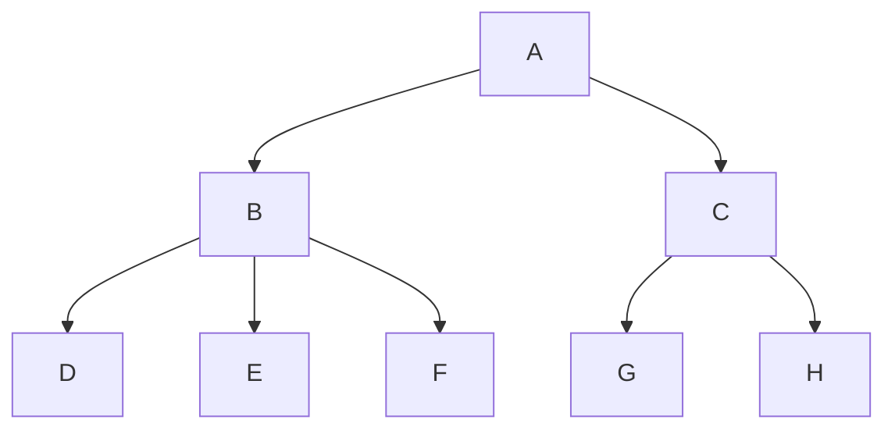

# 🦉 Organising Owl code 🦉

## Content

- [Overview](#overview)
- [Reactivity](#reactivity)
- [Asynchrony](#asynchrony)
- [Basic design: Components and Props](#basic-design-components-and-props)
- [More advanced design: using the environment](#more-advanced-design-using-the-environment)
- [Even more advanced: completely separating model management](#even-more-advanced-completely-separating-model-management)
- [Special case: bypassing reactivity](#special-case-bypassing-reactivity)

## Overview

The topic of this document is to discuss how one could organize an Owl
application/component/feature/codebase. Clearly, good practices for a system depends
on its properties/semantics. For Owl 2.x applications, the most important
ideas to have in mind are the following:

- Owl provides a way to structure a component tree,
- communication between a parent and a child component is mostly done with props
  (and callback props to go from child to parent),
- there is an additional communication channel: information can be propagated
  through the environment,
- Owl implements a reactivity system, which tracks each components and values,
  so that it is able to only rerender the relevant subset of components,
- asynchrony: owl components can delay renderings with `onWillStart`/`onWillUpdateProps`
- renderings are batched (10 calls to render in the same call stack will only
  result in 1 actual rendering)

## Reactivity

With the reactivity system, each value created with the `useState` or the `reactive`
function is a proxy that allows Owl to trask which keys/values have been read
by which components. This means that Owl can then only update the components that
are impacted by a state change.

There are two important reactivity primitives:

- `useState`: a hook to turn a value into a reactive value, linked to a component
  (so, each time the value is updated, the component is rerendered)
- `reactive`: a function to create a "standalone" reactive value

Also, it is good to know that one can call `useState` on a reactive value: this will
create another reactive value, connected to the same source, but linked to a
different component.

Let us consider the following component tree:



It is important to know how renderings are applied by Owl:

- if a render is initiated in A, it will render its template
- whenever it encounter a child component (here, B and C), it will shallow
  compare the before and after props. If they are different, Owl will render the
  corresponding child component, otherwise it will stop.
- each props object received by a (child) component is turned into a reactive
  object.

Each (non primitive) value given by `A` to `B` and `C` will be transformed into
a reactive object.
basically, owl does a useState on props at each level, and compare
shallowly values

Notes:

- each component can be independently rendered (so, for example, only B and D)
- one can create reactive objects (just like useState, but not linked to any
  component) with the `reactive` function
- escape hatch: one can mark an object as "raw" (non reactive) with `markRaw`, and get the target
  object (with `toRaw`)
- note that it is bad practice to keep reference to the raw object: doing so means
  that some => may miss
  rendering

- note: reactivity is not free. It may be expensive for some large objects.

## Asynchrony

explain: onWillStart and onWillUpdateProps are async => can delay render

good usecase for lazyloading libs

note: most of the time, update should be done in an atomic way:

```js
// bad => will cause extra rendering, possibly corrupt
this.state.something = someValue;
const otherValue = await this.fetchSomething();
this.state.otherValue = otherValue;
```

```js
// good
const otherValue = await this.fetchSomething();
this.state.something = someValue;
this.state.otherValue = otherValue;
```

```js
// bad => will cause extra rendering, possibly corrupt
const someValue = getsomeValue();
const otherValue = await this.fetchSomething();
Object.assign(this.state, {
  someValue,
  otherValue,
});
```

other note: minimize async stuff

```js
setup() {
    // strategy 1: have a loading screen
    this.state = useState({loading: true});
}
```

```xml
<t t-if="state.loading">
</t>
...
```

// other strategy: not display a loading indicator, and update the UI atomically

```js
setup() {
    onWillStart(() => this.loadData());
    onWillUpdateProps(() => this.updateData());
}
```

## Baseline design: Components and props

Here is what I suppose many Owl systems will look like: `useState` in some components,
state is propagated down the tree with props, and potentially callbacks as well
(to communicate from child to parent)

     A

/ \
 B C
/ | \ | \
D E F G H

```js
// in A (and maybe some/all other components)
this.state = useState(...);
```

```xml
<!-- in A -->
<div>
    <t t-if="state.message">
        <span t-esc="state.message"/>
    </t>
    <B record="state.records[3]" updateValue.bind="updateValue">
</div>
```

Notice the `.bind` suffix here, very convenient.

```xml
<!-- in B. It is now subscribed to the 'some_field' value -->
<span t-esc="props.record.some_field"/>
```

With reactivity, any update to the state will only rerender the affected components.
So, if some code in `A` update the value of `some_field` (without reading it!),
only B will be rerendered.

## More advanced design: passing stuff through the environment

It may be tedious/impractical to pass props all along the tree when we have a deep
component tree.

One can then use the environment to communicate to children. Only issue with that
is that stuff in the environment bypass the reactivity system: if it comes from
a `useState` in `A` => only `A` will react to state changes, not the children that
reads it.

To solve that, one need to use `useState` on it:

```js
// in root component A
class A extends Component {
  setup() {
    this.posModel = {
      state: useState(this.state),
      updateSomeValue: () => this.updateSomeValue(),
      doSomethingElse: () => this.doSomethingElse(),
    };
    useSubEnv({ posModel: this.posModel });
  }
}

// in some child component D
class D extends Component {
  setup() {
    // this one is wrong! this.posModel.state is stated
    this.posModel = this.env.posModel;

    // this.posModel.state === the one in A, linked to the component A

    // this one is ok!
    this.posModel = useState(this.env.posModel);
  }
}
```

Note that we can slightly simplify the use of the model by a hook:

```js
function usePosModel() {
  const env = useEnv();
  const model = env.posModel;
  return useState(model);
}
```

This is not much simpler, but it makes sure that one does not forget to call
`useState` on the model from the environment.

## Even more advanced: completely separating model management

The baseline design above it nice for many usecases, but we sometimes may want
to separate the "model" management from the UI, especially as the model is doing
more complicated stuff. Useful to code some complex transitions.

Here is how we could use the environment and reactive object to organize code:

```js
// in my_model.js
class MyModel {
    ...
    constructor() {
        this.complicatedCacheObject = {};

        markRaw(this.complicatedCacheObject);
    }

    async load(...) {

    }

    async update(...) {

    }

    async doSomeComplexThing() {
        this.loading = true;

        // coordinate here some thing
        // fetch stuff...

        this.loading = false;
        this.data = ...;
        ...
    }
    ...
}

// in root component A:

class A extends Component {
    setup() {
        const model = useState(new MyModel(...));
        useSubEnv({ model });
    }
}

// in some child component:
class D extends Component {
    setup() {
        // notice the useState: this is necessary to bind model changes to the
        // component D
        this.model = useState(this.env.model);
    }
}

```

Notes:

- model could be created elsewhere, in a service, in the start code, ...
- one may want to mark some internal stuff as 'raw'...
- if created elsewhere, it should probably be done with `reactive`
- the call to `reactive` could be done in the model constructor directly:

  ```js
  class MyModel {
      constructor() {
          ...
          return reactive(this);
      }
  }
  ```

- one could slightly simplify the model use with a hook:

```js
function useModel() {
  const env = useEnv();
  const model = env.model;
  return useState(model);
}
```

This can be simply used like this in a child component:

```js
setup() {
    this.model = useModel();
}
```

## Special case: bypassing reactivity

Sometimes, reactivity is not what we want. For example, the o_spreadsheet
library has a huge extremely complex model, and each state transition may
potentially update the full UI, so it needs to be fast anyway, and reactivity
has a cost that may outweight the benefits.

The strategy here is:

- mark the model as raw (not necessary in all cases, but potentially important
  if model is passed through some props)
- find a way to be notified on update change (for example, by an event triggered
  by an event bus)
- perform a deep rendering: render(true), at the root component.

Here is how one could organize the code then:

```js
class MainModel extends EventBus{
    constructor() {
        markRaw(this); // make sure this object will never be turned into a reactive
    }

    doSomething() {
        ...
        // need to notify the outside world that a change occurred
        this.trigger("UPDATE");
    }
    ...
}

// in root component:
class A extends Component {
    setup() {
        const model = new MainModel();

        // notice the 'render(true)', to do a deep render
        model.addEventListener("UPDATE", () => this.render(true));
        useSubEnv({ model });
    }
}

// in child components:
class E extends Component {
    setup() {
        this.model = this.env.model; // not really necessary, but maybe nice
    }

    onClick() {
        this.model.doSomething();
    }
}
```
