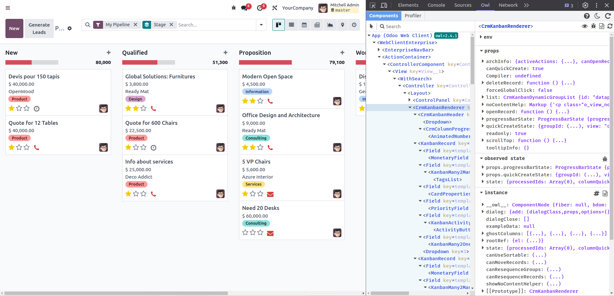
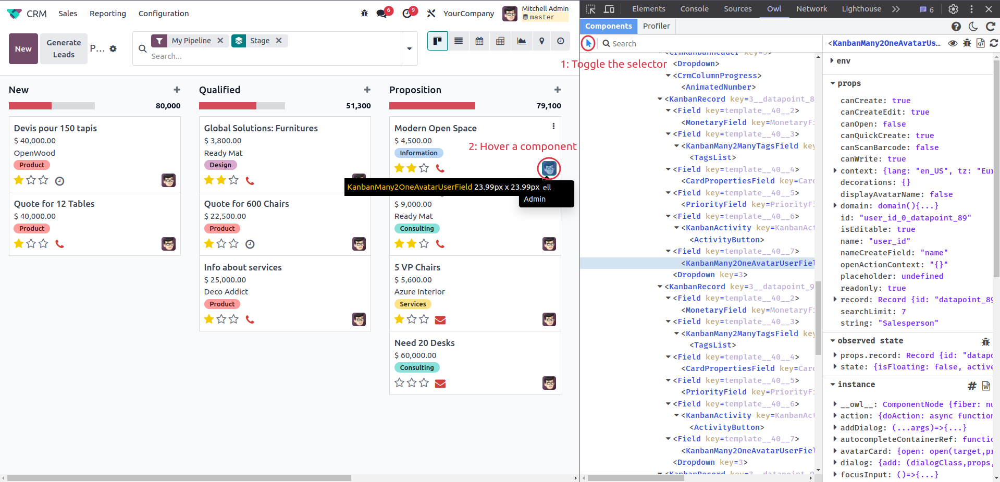
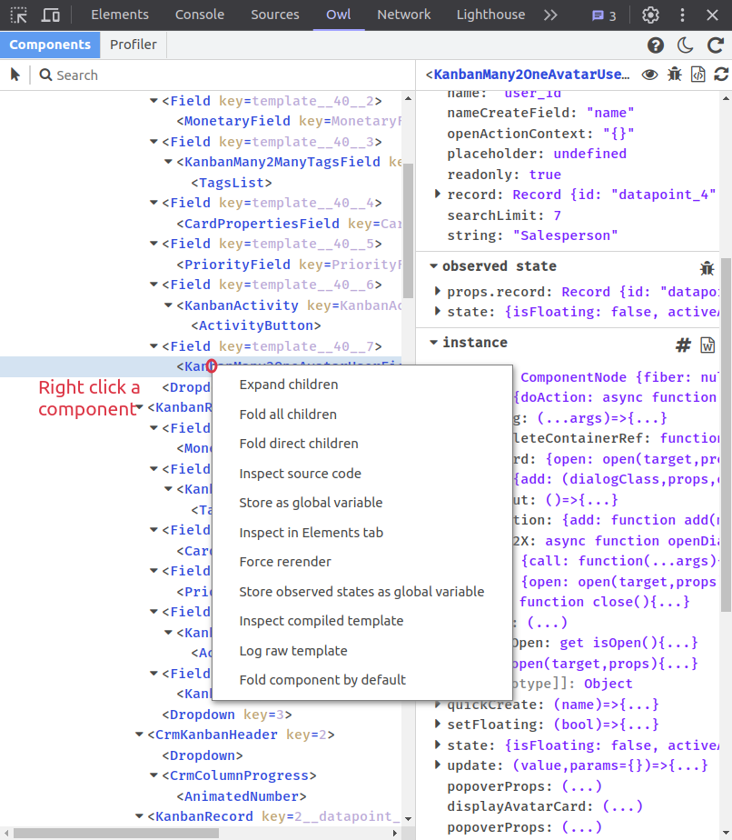
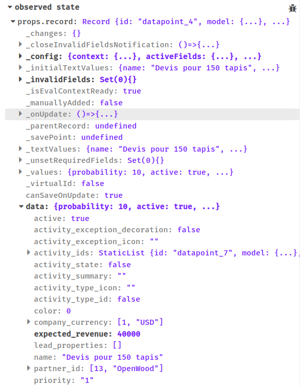
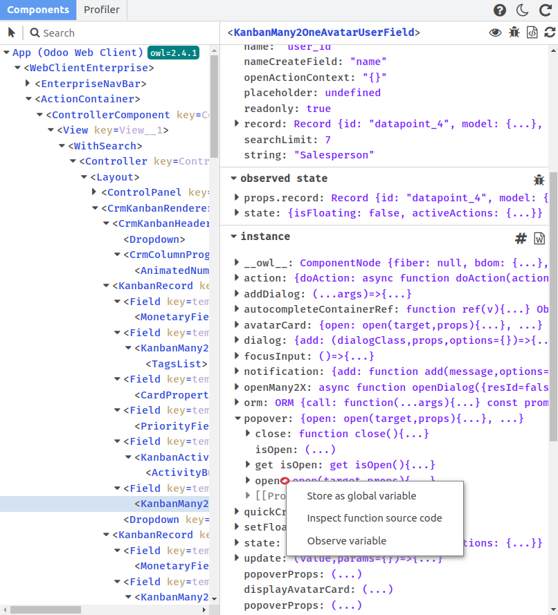
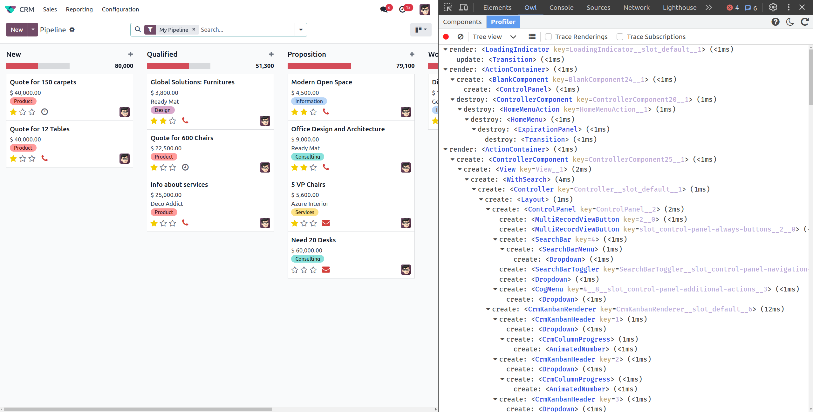
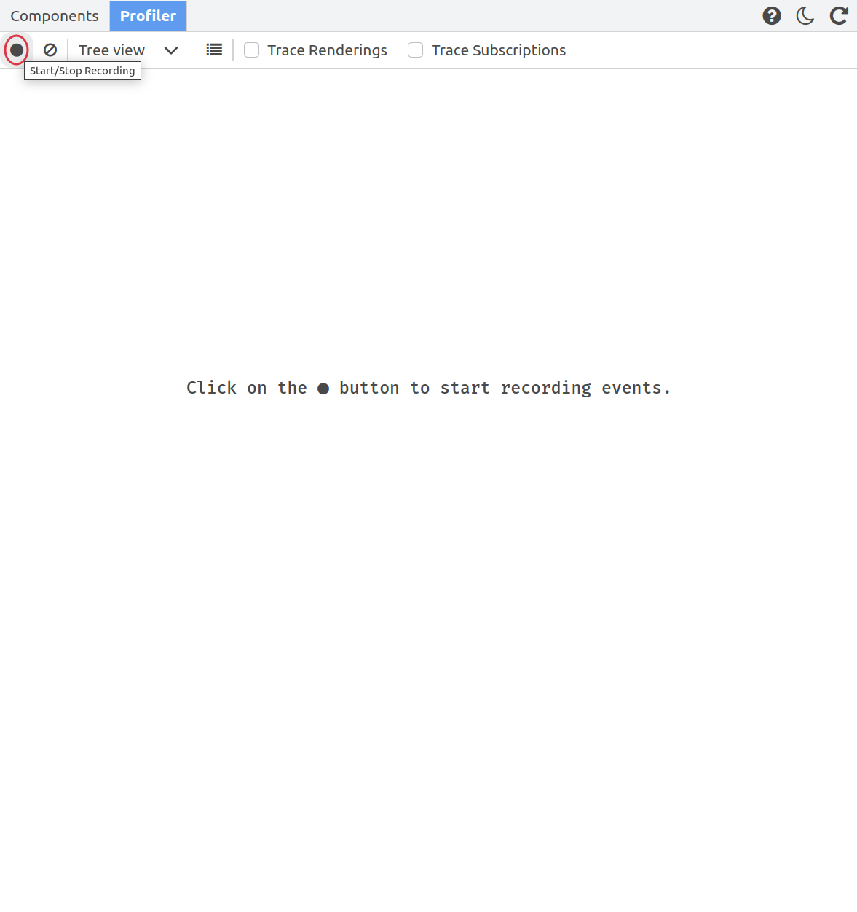
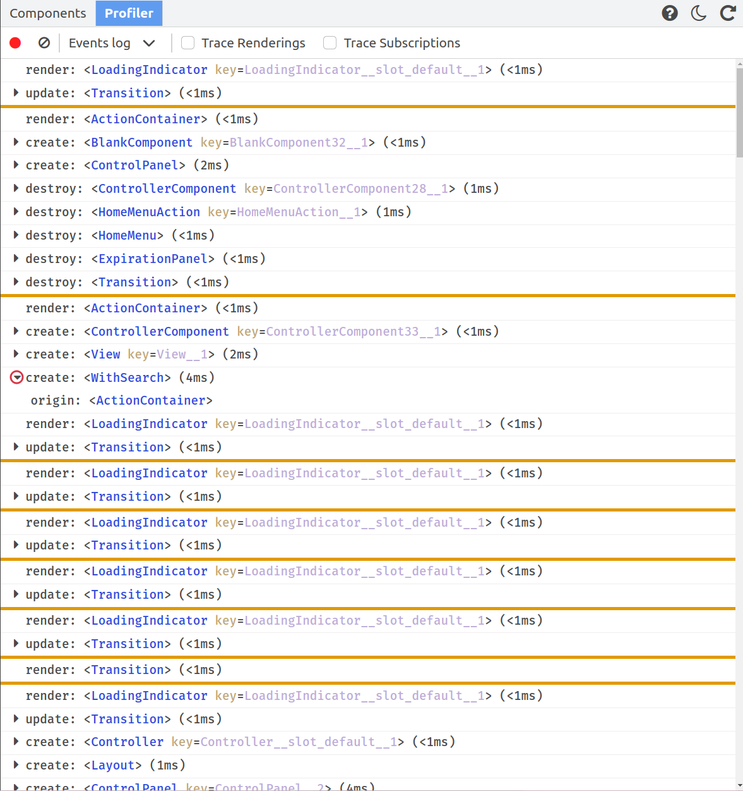
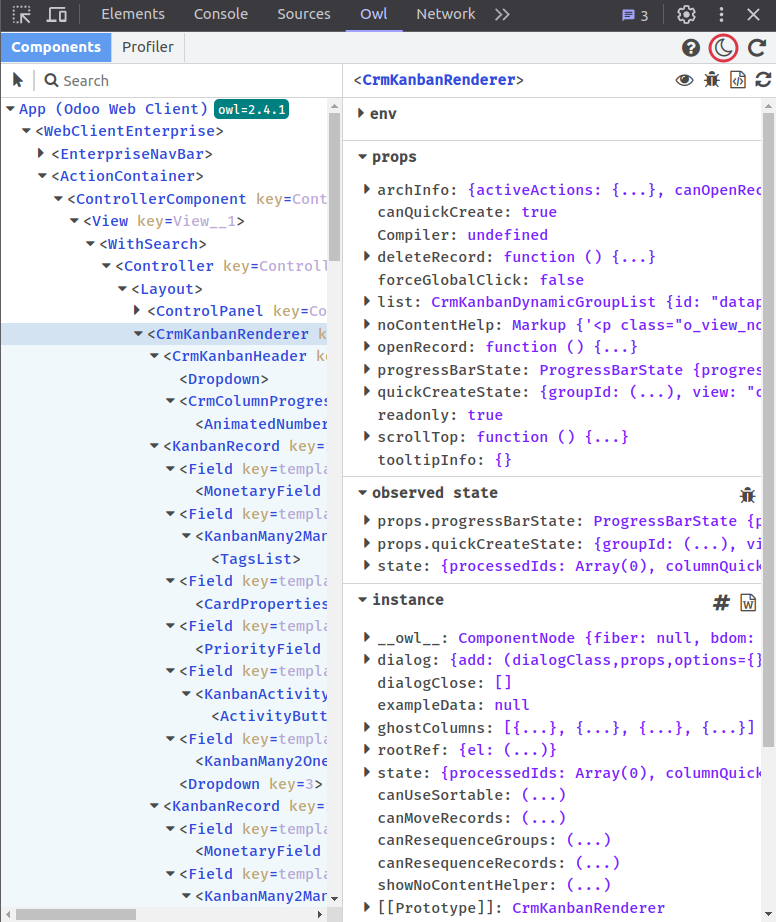

# Owl Devtools Guide

## Information popup

After having installed the extension, a new icon will be added to your extension bar.
If you don't see it, you can pin the extension using the extensions popup.

Clicking on the owl icon will open the information popup. This popup is useful
to know in advance whether owl is loaded in the tab or not. This is also indicated
by the icon itself: if it is flipped upside-down, it means that owl is not loaded in the
active tab. Do note that old versions of owl are not supported by the extension and will
therefore be indicated either as obsolete or absent by the extension popup.

## First steps

When you are on a page where owl is detected, you can open your devtools either with
right-click -> Inspect or using F12. In the devtools menu, you can search for the Owl
tab which is added by the extension. It will be present by default at the end of the list but
you can drag and drop it at the position you want for easier navigation in the future.

When you open the tab, you arrive on the Components view by default which is one of the
two available tabs at the top. Here is an example of the devtools on the Odoo CRM app:

## Components tab

The components tab is separated into two sub windows: the components tree in the left and
the component details in the right. The components tree will display all the different
components that are present in the tab in the form of a tree. The root of this tree is
actually the app which is not a component but can still be inspected by the devtools like
one. There can also be multiple apps loaded in the page like in website:

There is a convenient search bar at the top of the components tree which will help finding
the components tou want in the tree and also, an element picker can be used to directly select
the component you want to focus on in the page which is especially useful when 1trying to find
what you want. Just click on the elements picker icon and click on the element you want to focus
on in the page and it will be selected in the devtools accordingly. Hovering any element in the
page in this mode will highlight it and the same happens anytime in the components tree.

In the tree itself, the navigation is quite simple and is similar to the one in the Elements tab
of the browser's devtools. It is possible to navigate with the keyboard using the arrow keys and
multiple shortcuts are available in a custom menu when right-clicking on a component. This menu
allows to expand/fold all the children nodes of a component, fold its direct children only, inspect
the source code of the component, send it as a global variable in the console, go to the Elements tab
and focus on its content, force a rerender of the component, send its observed states to the console
as a global variable, inspect its compiled template in the Sources tab or send its raw template
to the console.

The component details window in the right will show the component that is currently selected as well
as its env, props, observed states and all the other variables that are present on its instance.
While the props and the env are already present on the actual instance of the component and are
pretty explicit by themselves, the observed state value is a bit more complicated to grasp.

The observed state is actually information about which variables are being observed by the component:
when any property of a reactive object is being read by the component, the component will subscribe
to this property which means it will listen to any change that can occur on the property and render
when such a change occurs. This can be visualized easily within the devtools inside of the observed
state section: observed properties of the reactive object(s) are displayed in bold while the others
are greyed out. Do keep in mind that a greyed out property in the observed state of one component
may be observed by another and the other way around is also possible. Here is an example for some
user Field component:

Navigation inside the properties is also similar to the one in console variables: properties have
their prototype displayed and getters will get their value when clicked on (...). It is also possible to
send any property to the console using the right-click context menu on it and functions can be inspected
in the sources tab as well.

There are several icons available to perform several of the actions described before in the components
tree context menu and all these actions are also available by opening the menu by right-clicking on the
component's name. Using the left click on the component's name will focus it in the components tree.

It is also possible to edit any of the leaf node properties. To do so, you must double click on the
property's value and modify it using the freshly created input then press enter to apply the changes.
Do note that the modified values should be written in JSON format in order to be valid (examples:
89, "yes", undefined, null, \["hello", 15\], {"a": 1}, true, ...). Editing any value will produce a
manual render of the component (or the root component of the application in the case of env values).
Whether the edition has an impact on the component or not and whether it produces an error is the
responsability of the user.

## Profiler

The profiler tab is the other tab of the owl devtools. It consists in an actions bar at the top and
a tree/list of events related to the owl components' renders. Here is an example of the events launched
when entering the Odoo Crm app.

In the initial state, no event is displayed. You need to activate the recording of events before they
are intercepted by the devtools using the record button.

The second button is used to clear all the events that have been recorded. The select can be used to
switch between the tree view (which shows the causality between renders) and the events log view which
simply displays the events in the exact order they were triggered. In this view, you can expand the create,
update and destroy events which reveals the component that initiated the event. Also, a transition line will
appear each time a new animation frame has been loaded between events.

The third button is only visible in tree view and allows to fold all the render events that were recorded.
Some actions are also available when using the right-click on any event of the tree view for navigation
purpose in a similar fashion as in the components tree.

There is also the Trace Renderings and Trace Subscriptions features. These features are independant of the
recording of events and have no effect on the profiler tab. The Trace Renderings option is used to log in
the console all the render events and allows to show their traceback information. Similarly, the Trace
Subscriptions option logs all the properties that caused a render event and also allows to see the traceback
of the modification.

The Owl Devtools also allow to inspect iframes coded in Owl: when an Owl iframe is detected in the page,
the iframe selector will appear next to the tabs. This allows to switch from an iframe to another easily.
Be aware that switching iframes will clear all record events from the profiler tab. Iframes detection is
currently not working in the firefox version, we are aware of this issue and will try to address it in the
future.

## Options

The owl devtools extension has a dark mode feature which defaults to your general devtools settings and can
be toggled using the sun/moon icon at the top-right corner of the tab. There is also a refresh button to
completely reset the owl devtools.

## Troubleshooting

If the feedback from the page to the devtools seems to be cut, you can first try to use the refresh
button mentioned above but if it still doesn't seem to work, just close the devtools and refresh the page.
This will eventually happen any time a tab stays opened for too long without being refreshed.
