# Owl Devtools Guide

> This guide covers the devtools for **Owl 3** apps. If you are inspecting an **Owl 2** app, refer to the
> [Owl 2 devtools guide](../../../v2/tools/devtools_guide.md) — some features described there (env inspection,
> observed state / subscription tracing) are only available for Owl 2 apps.

## Information popup

After having installed the extension, a new icon will be added to your extension bar.
If you don't see it, you can pin the extension using the extensions popup.

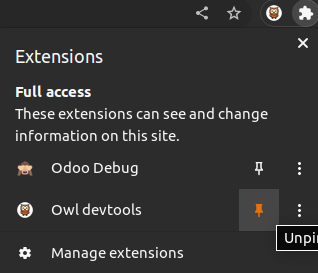

Clicking on the owl icon will open the information popup. This popup is useful
to know in advance whether owl is loaded in the tab or not. This is also indicated
by the icon itself: if it is flipped upside-down, it means that owl is not loaded in the
active tab. Do note that old versions of owl are not supported by the extension and will
therefore be indicated either as obsolete or absent by the extension popup.

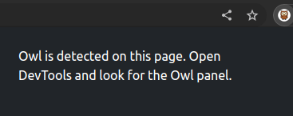

## First steps

When you are on a page where owl is detected, you can open your devtools either with
right-click -> Inspect or using F12. In the devtools menu, you can search for the Owl
tab which is added by the extension. It will be present by default at the end of the list but
you can drag and drop it at the position you want for easier navigation in the future.

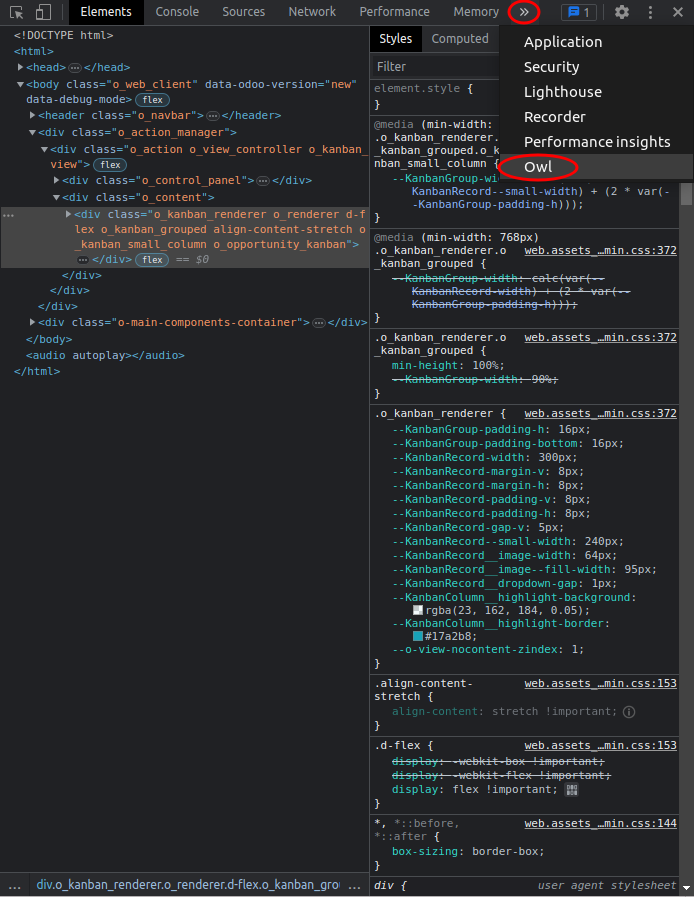

When you open the tab, you arrive on the Components view by default which is one of the
two available tabs at the top. Here is an example of the devtools on the Odoo CRM app:

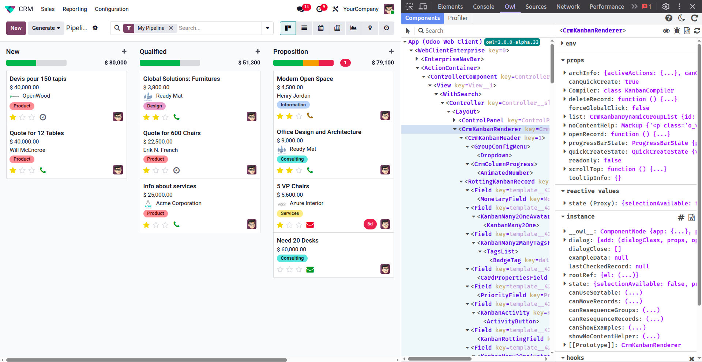

## Components tab

The components tab is separated into two sub windows: the components tree in the left and
the component details in the right. The components tree will display all the different
components that are present in the tab in the form of a tree. The root of this tree is
actually the app which is not a component but can still be inspected by the devtools like
one. There can also be multiple apps loaded in the page like in website:

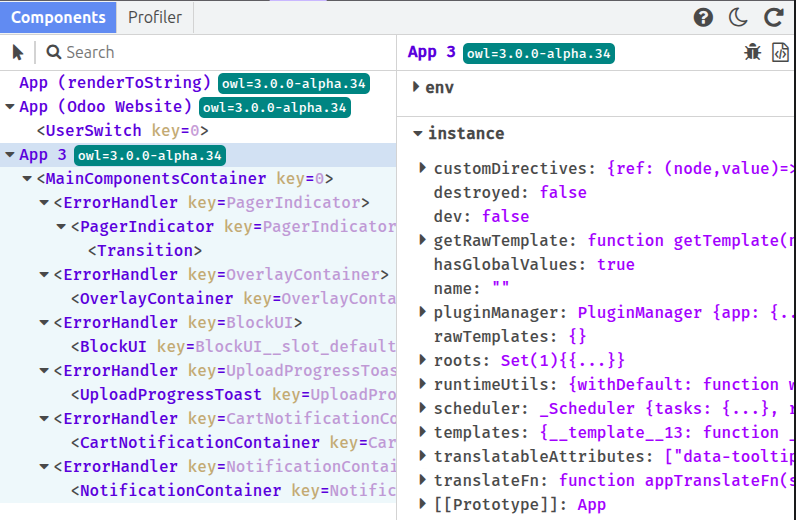

There is a convenient search bar at the top of the components tree which will help finding
the components you want in the tree and also, an element picker can be used to directly select
the component you want to focus on in the page which is especially useful when trying to find
what you want. Just click on the element picker icon and click on the element you want to focus
on in the page and it will be selected in the devtools accordingly. Hovering any element in the
page in this mode will highlight it and the same happens anytime in the components tree.

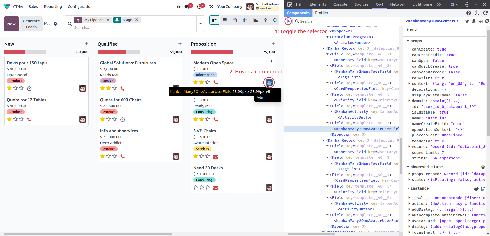

In the tree itself, the navigation is quite simple and is similar to the one in the Elements tab
of the browser's devtools. It is possible to navigate with the keyboard using the arrow keys and
multiple shortcuts are available in a custom menu when right-clicking on a component. This menu
allows to expand/fold all the children nodes of a component, fold its direct children only, inspect
the source code of the component, send it as a global variable in the console, go to the Elements tab
and focus on its content, force a rerender of the component, inspect its compiled template in the
Sources tab or send its raw template to the console.

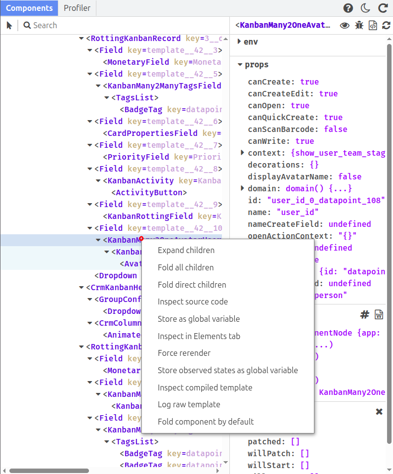

The component details window in the right will show the component that is currently selected as well
as its props, reactive values, and all the other variables that are present on its instance.

### Props

The props section displays the component's current props, including any default values defined on the
component class. The key shown next to each prop indicates whether it comes from the passed props or
from the component's `defaultProps`.

### Reactive values

Owl 3 introduces a fine-grained reactivity model based on signals, computed values, and reactive proxies.
The reactive values section groups all reactive state declared directly on the component instance:

- **Signals** — scalar reactive values created with `signal()`. Their current value is displayed inline.
- **Computed** — derived reactive values created with `computed()`. Their current computed value is shown.
- **Proxies** — reactive objects created with `proxy()`. They are displayed and navigable like any other
  object in the devtools.

### Instance

The instance section shows all other properties present directly on the component instance, along with
its full prototype chain. Getters are displayed as `(...)` and their value is loaded on click.

### Hooks

The last section of the details window is filled with the component's lifecycle hooks. Using right-click
on them allows to place breakpoints inside the hook (either on its instance or class; hooks like `mounted`
and `willStart` cannot have instance-based breakpoints because they will never trigger again once the
component is mounted). Conditions in conditional breakpoints will be evaluated in the context of the
component's definition.

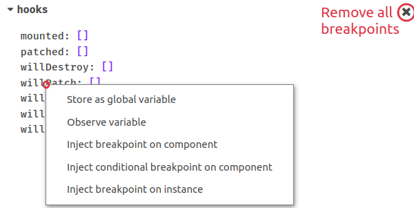

---

Navigation inside the properties is similar to the one in console variables: properties have
their prototype displayed and getters will get their value when clicked on `(...)`. It is also possible to
send any property to the console using the right-click context menu on it and functions can be inspected
in the sources tab as well.

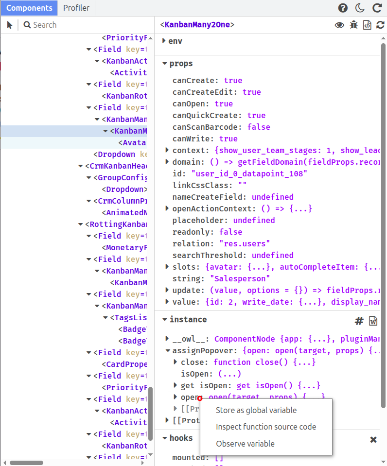

Using the right-click context menu on a property also allows to observe variables. Observed variables will
be sent to a dedicated section of the details window and their value will be refreshed every 200ms. These
variables are only shown when they are found and their access path will be kept in memory inside the
browser so that it will always persist until the user decides to stop observing the variable. As in the
browser's devtools, observed objects are displayed in reduced form and cannot be interacted with. It is
still possible to send them to the console or remove them from the list using right-click.

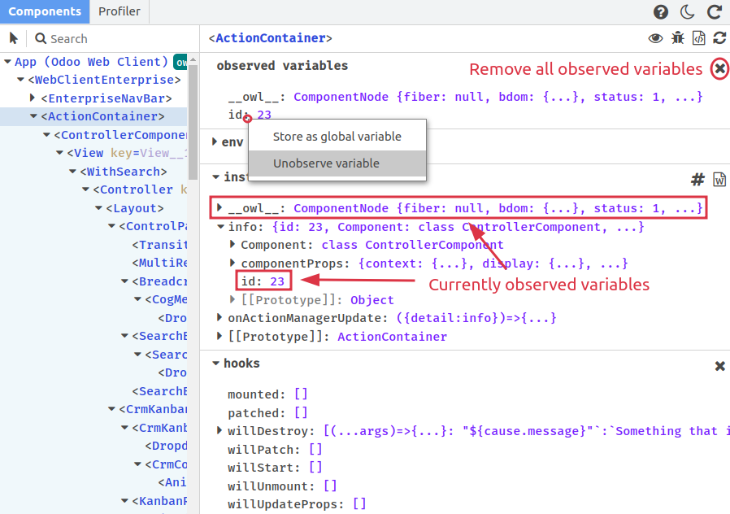

There are several icons available to perform several of the actions described in the context menu and all
these actions are also available by right-clicking on the component's name. Using the left click on the
component's name will focus it in the components tree.

It is also possible to edit any leaf node property. To do so, double-click on the property's value and
modify it using the freshly created input, then press Enter to apply the changes.
Do note that the modified values should be written in JSON format in order to be valid (examples:
89, "yes", undefined, null, \["hello", 15\], {"a": 1}, true, ...). Editing any value will produce a
manual render of the component.
Whether the edition has an impact on the component or not and whether it produces an error is the
responsibility of the user.

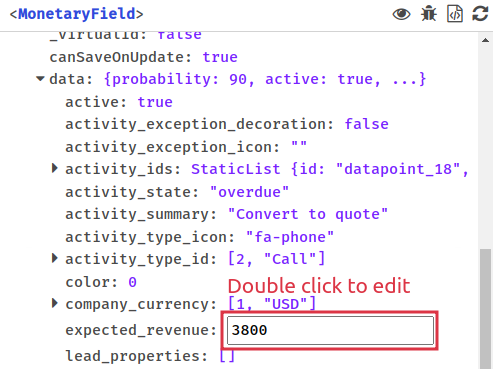

## Profiler

The profiler tab is the other tab of the owl devtools. It consists in an actions bar at the top and
a tree/list of events related to the owl components' renders. Here is an example of the events launched
when entering the Odoo CRM app.

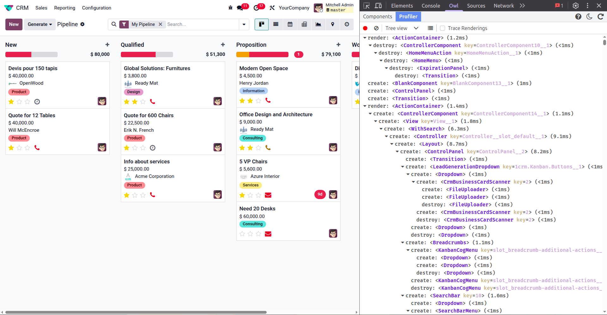

In the initial state, no event is displayed. You need to activate the recording of events before they
are intercepted by the devtools using the record button.

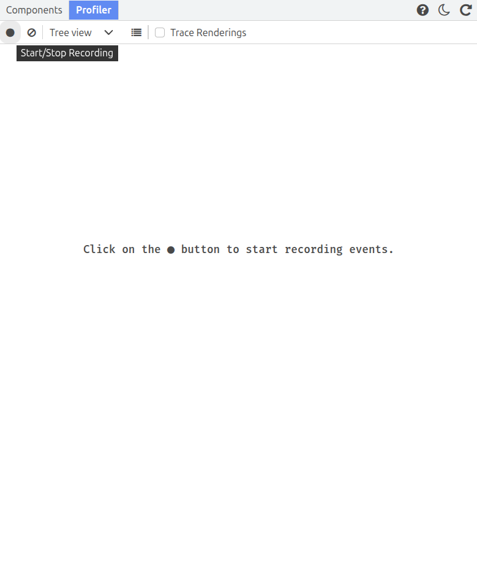

The second button is used to clear all the events that have been recorded. The select can be used to
switch between the tree view (which shows the causality between renders) and the events log view which
simply displays the events in the exact order they were triggered. In this view, you can expand the create,
update and destroy events which reveals the component that initiated the event. Also, a transition line will
appear each time a new animation frame has been loaded between events.

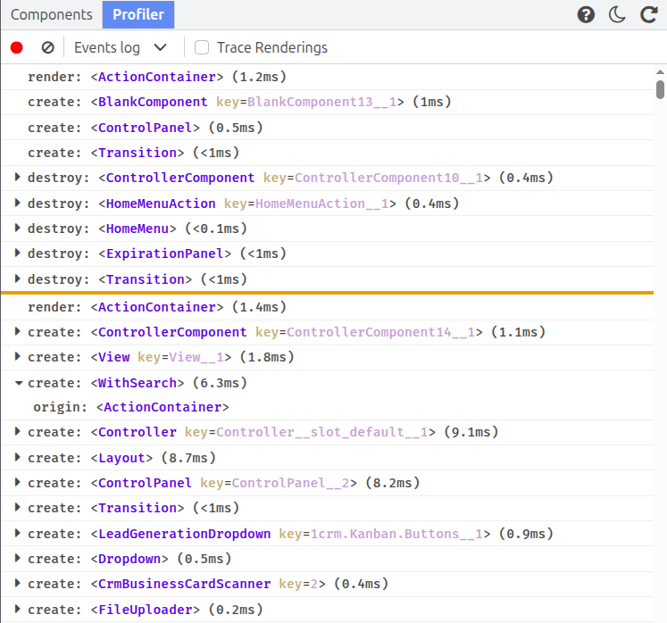

The third button is only visible in tree view and allows to fold all the render events that were recorded.
Some actions are also available when using the right-click on any event of the tree view for navigation
purpose in a similar fashion as in the components tree.

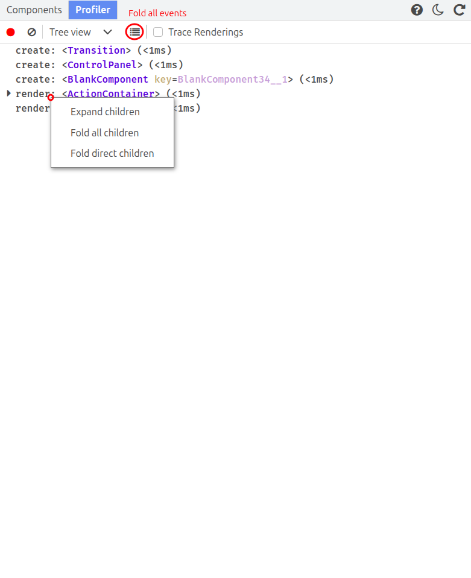

### Trace Renderings

The **Trace Renderings** feature is independent of the recording of events and has no effect on the
profiler tab display. When enabled, it logs all render events to the console together with their traceback,
making it easy to identify what triggered a re-render.

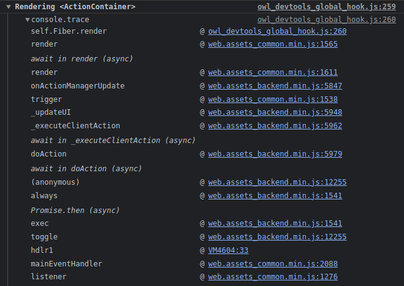

> **Note:** The **Trace Subscriptions** feature visible in Owl 2 is not available for Owl 3 apps. Owl 3
> uses a signal-based reactivity model where subscription tracking works differently. Trace Subscriptions
> remains available when inspecting Owl 2 apps — see the
> [Owl 2 devtools guide](../../../v2/tools/devtools_guide.md).

The Owl Devtools also allow to inspect iframes coded in Owl: when an Owl iframe is detected in the page,
the iframe selector will appear next to the tabs. This allows to switch from an iframe to another easily.
Be aware that switching iframes will clear all record events from the profiler tab. Iframes detection is
currently not working in the Firefox version, we are aware of this issue and will try to address it in the
future.

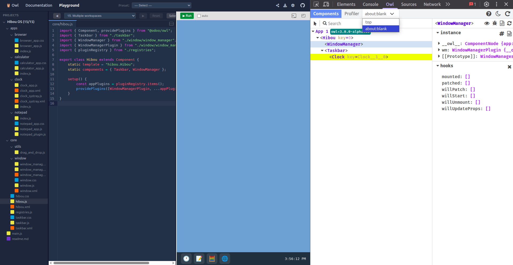

## Options

The owl devtools extension has a dark mode feature which defaults to your general devtools settings and can
be toggled using the sun/moon icon at the top-right corner of the tab. There is also a refresh button to
completely reset the owl devtools.

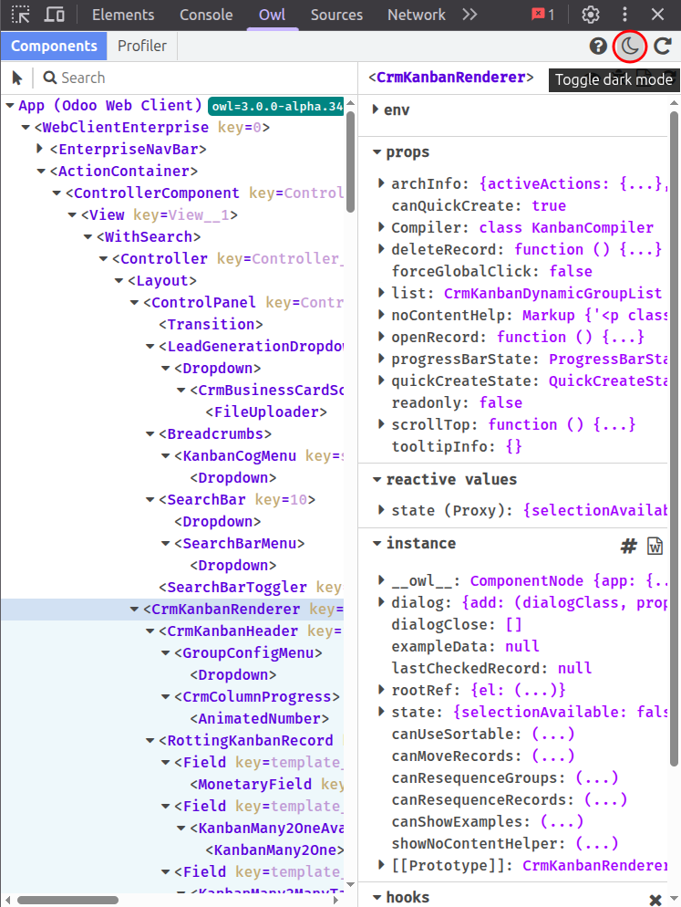

## Troubleshooting

If the feedback from the page to the devtools seems to be cut, you can first try to use the refresh
button mentioned above but if it still doesn't seem to work, just close the devtools and refresh the page.
This will eventually happen any time a tab stays opened for too long without being refreshed.
